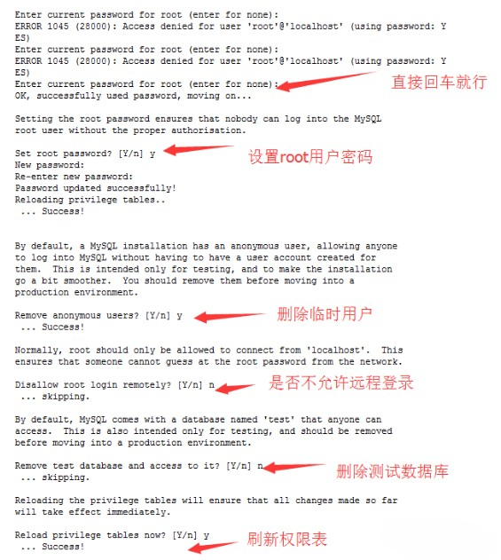

# Linux常用命令（基础命令）

## Linux命令介绍

### 命令行提示符介绍

进入命令行环境以后，用户会看到 `Shell` 的提示符。提示符往往是一串前缀，最后以一个美元符号 `$` 结尾，用户可以在这个符号后面输入各种命令。

执行一个简单的命令 `pwd` ：

```
[root@iZm5e8dsxce9ufaic7hi3uZ ~]# pwd
/root
```

命令解析：

- `root`：表示用户名；
- `iZm5e8dsxce9ufaic7hi3uZ`：表示主机名；
- `~`：表示目前所在目录为家目录，其中 `root` 用户的家目录是 `/root` 普通用户的家目录在 `/home` 下；
- `#`：指示你所具有的权限（ `root` 用户为 `#` ，普通用户为 `$` ）。
- 执行 `whoami` 命令可以查看当前用户名；
- 执行 `hostname` 命令可以查看当前主机名；

关于如何创建、切换、删除用户，在后面的用户与权限会具体讲解，这里先使用 `root` 用户进行演示。

[备注] `root` 是超级用户，具备操作系统的一切权限。

### 命令格式

```
command parameters（命令 参数）
```

#### 长短参数

```
单个参数：ls -a（a 是英文 all 的缩写，表示“全部”）
多个参数：ls -al（全部文件 + 列表形式展示）
单个长参数：ls --all
多个长参数：ls --reverse --all
长短混合参数：ls --all -l
```

#### 参数值

```
短参数：command -p 10（例如：ssh root@121.42.11.34 -p 22）
长参数：command --paramters=10（例如：ssh root@121.42.11.34 --port=22）
```

## 快捷键介绍

在开始学习 `Linux` 命令之前，有这么一些快捷方式，是必须要提前掌握的，它将贯穿整个 `Linux` 使用生涯。

- 通过上下方向键 ↑ ↓ 来调取过往执行过的 `Linux` 命令；
- 命令或参数仅需输入前几位就可以用 `Tab` 键补全；
- `Ctrl + R` ：用于查找使用过的命令（`history` 命令用于列出之前使用过的所有命令，然后输入 `!` 命令加上编号( `!2` )就可以直接执行该历史命令）；
- `Ctrl + L`：清除屏幕并将当前行移到页面顶部；
- `Ctrl + C`：中止当前正在执行的命令；
- `Ctrl + U`：从光标位置剪切到行首；
- `Ctrl + K`：从光标位置剪切到行尾；
- `Ctrl + W`：剪切光标左侧的一个单词；
- `Ctrl + Y`：粘贴 `Ctrl + U | K | Y` 剪切的命令；
- `Ctrl + A`：光标跳到命令行的开头；
- `Ctrl + E`：光标跳到命令行的结尾；
- `Ctrl + D`：关闭 `Shell` 会话；

## 文件和目录介绍

### 文件的组织结构介绍


## 用户与权限

### 用户

`Linux` 是一个多用户的操作系统。在 `Linux` 中，理论上来说，我们可以创建无数个用户，但是这些用户是被划分到不同的群组里面的，有一个用户，名叫 `root` ，是一个很特殊的用户，它是超级用户，拥有最高权限。


自己创建的用户是有限权限的用户，这样大大提高了 `Linux` 系统的安全性，有效防止误操作或是病毒攻击，但是我们执行的某些命令需要更高权限时可以使用 `sudo` 命令。

#### sudo

以 `root` 身份运行命令

```
sudo date  --> 当然查看日期是不需要sudo的这里只是演示，sudo 完之后一般还需要输入用户密码的
```

#### useradd + passwd

- `useradd` 添加新用户
- `passwd` 修改用户密码

这两个命令需要 `root` 用户权限

```
useradd lion --> 添加一个lion用户，添加完之后在 /home 路径下可以查看
passwd lion --> 修改lion用户的密码
```

#### userdel

删除用户，需要 `root` 用户权限

```
userdel lion --> 只会删除用户名，不会从/home中删除对应文件夹
userdel lion -r --> 会同时删除/home下的对应文件夹
```

#### su

切换用户，需要 `root` 用户权限

```
sudo su --> 切换为root用户（exit 命令或 CTRL + D 快捷键都可以使普通用户切换为 root 用户）
su lion --> 切换为普通用户
su - --> 切换为root用户
```

### 群组的管理

`Linux` 中每个用户都属于一个特定的群组，如果你不设置用户的群组，默认会创建一个和它的用户名一样的群组，并且把用户划归到这个群组。

#### groupadd

创建群组，用法和 `useradd` 类似。

```
groupadd friends
```

#### groupdel

删除一个已存在的群组

```
groupdel foo  --> 删除foo群组
```

#### groups

查看用户所在群组

```
groups lion  --> 查看 lion 用户所在的群组
```

#### usermod

用于修改用户的账户。

【常用参数】

- `-l` 对用户重命名。需要注意的是 `/home` 中的用户家目录的名字不会改变，需要手动修改。
- `-g` 修改用户所在的群组，例如 `usermod -g friends lion`修改 `lion` 用户的群组为 `friends` 。
- `-G` 一次性让用户添加多个群组，例如 `usermod -G friends,foo,bar lion` 。
- `-a` `-G` 会让你离开原先的群组，如果你不想这样做的话，就得再添加 `-a` 参数，意味着`append` 追加的意思。

#### chgrp

用于修改文件的群组。

```
chgrp bar file.txt --> file.txt文件的群组修改为bar
```

#### chown

改变文件的所有者，需要 `root` 身份才能运行。

```
chown lion file.txt --> 把其它用户创建的file.txt转让给lion用户
chown lion:bar file.txt --> 把file.txt的用户改为lion，群组改为bar
```

【常用参数】

- `-R` 递归设置子目录和子文件， `chown -R lion:lion /home/frank` 把 `frank` 文件夹的用户和群组都改为 `lion` 。

### 文件权限管理

#### chmod

修改访问权限。

```
chmod 740 file.txt
```

【常用参数】

- `-R` 可以递归地修改文件访问权限，例如 `chmod -R 777 /home/lion`

修改权限的确简单，但是理解其深层次的意义才是更加重要的。下面我们来系统的学习`Linux` 的文件权限。

```
[root@lion ~]# ls -ldrwxr-xr-x 5 root root 4096 Apr 13  2020 climblrwxrwxrwx 1 root root    7 Jan 14 06:41 hello2.c -> hello.c-rw-r--r-- 1 root root  149 Jan 13 06:14 hello.c
```

其中 `drwxr-xr-x` 表示文件或目录的权限。让我们一起来解读它具体代表什么？

- `d` ：表示目录，就是说这是一个目录，普通文件是 `-` ，链接是 `l` 。
- `r` ：`read` 表示文件可读。
- `w` ：`write` 表示文件可写，一般有写的权限，就有删除的权限。
- `x` ：`execute` 表示文件可执行。
- `-` ：表示没有相应权限。

权限的整体是按用户来划分的，如下图所示：


现在再来理解这句权限 `drwxr-xr-x` 的意思：

- 它是一个文件夹；
- 它的所有者具有：读、写、执行权限；
- 它的群组用户具有：读、执行的权限，没有写的权限；
- 它的其它用户具有：读、执行的权限，没有写的权限。

现在理解了权限，我们使用 `chmod` 来尝试修改权限。`chmod` 它不需要是 `root` 用户才能运行的，只要你是此文件所有者，就可以用 `chmod` 来修改文件的访问权限。

##### 数字分配权限

| 权限 | 数字 |
| :--- | :--- |
| r    | 4    |
| w    | 2    |
| x    | 1    |

因此要改变权限，只要做一些简单的加法就行：

```
chmod 640 hello.c # 分析6 = 4 + 2 + 0 表示所有者具有 rw 权限4 = 4 + 0 + 0 表示群组用户具有 r 权限0 = 0 + 0 + 0 表示其它用户没有权限对应文字权限为：-rw-r-----复制代码
```

##### 用字母来分配权限

- `u` ：`user` 的缩写，用户的意思，表示所有者。
- `g` ：`group` 的缩写，群组的意思，表示群组用户。
- `o` ：`other` 的缩写，其它的意思，表示其它用户。
- `a` ：`all` 的缩写，所有的意思，表示所有用户。
- `+` ：加号，表示添加权限。
- `-` ：减号，表示去除权限。
- `=` ：等于号，表示分配权限。

```
chmod u+rx file --> 文件file的所有者增加读和运行的权限chmod g+r file --> 文件file的群组用户增加读的权限chmod o-r file --> 文件file的其它用户移除读的权限chmod g+r o-r file --> 文件file的群组用户增加读的权限，其它用户移除读的权限chmod go-r file --> 文件file的群组和其他用户移除读的权限chmod +x file --> 文件file的所有用户增加运行的权限chmod u=rwx,g=r,o=- file --> 文件file的所有者分配读写和执行的权限，群组其它用户分配读的权限，其他用户没有任何权限复制代码
```

## 防火墙服务

### systemctl

> `systemctl`命令是`service`和`chkconfig`命令的组合体，可用于管理系统。

- 输出系统中各个服务的状态：

```java
systemctl list-units --type=service
```


- 查看服务的运行状态：

```
systemctl status firewalld
```


- 关闭服务：

```
systemctl stop firewalld
```


- 启动服务：

```
systemctl start firewalld
```


- 重新启动服务（不管当前服务是启动还是关闭）：

```
systemctl restart firewalld
```

- 重新载入配置信息而不中断服务：

```
systemctl reload firewalld
```

- 禁止服务开机自启动：

```
systemctl disable firewalld
```


- 设置服务开机自启动：

```
systemctl enable firewalld
```


## 文件管理

### 浏览和切换目录

#### ls

列出指定目录下的所有文件，列出`/`目录下的文件：

【常用参数】

- `-a` 显示所有文件和目录包括隐藏的
- `-l` 显示详细列表
- `-h` 适合人类阅读的
- `-t` 按文件最近一次修改时间排序
- `-i` 显示文件的 `inode` （ `inode` 是文件内容的标识）

示例：

```
ls -l /    通常的ls也可以
```


#### cd

改变当前工作目录：

```
cd / --> 跳转到根目录
cd ~ --> 跳转到家目录
cd .. --> 跳转到上级目录
cd ./home --> 跳转到当前目录的home目录下
cd /home/lion --> 跳转到根目录下的home目录下的lion目录
cd --> 不添加任何参数，也是回到家目录
```

[注意] 输入`cd /ho` + 单次 `tab` 键会自动补全路径 + 两次 `tab` 键会列出所有可能的目录列表。

示例：

```
cd /usr/local
```


### 查看路径

#### pwd

获取目前所在工作目录的绝对路径：


#### which

查看命令的可执行文件所在路径， `Linux` 下，每一条命令其实都对应一个可执行程序，在终端中输入命令，按回车的时候，就是执行了对应的那个程序， `which` 命令本身对应的程序也存在于 `Linux` 中。

总的来说一个命令就是一个可执行程序。

### 浏览和创建文件

#### cat

一次性显示文件所有内容，更适合查看小的文件。

用于查看文件时，例如查看Linux启动日志文件文件，并标明行号：

```
cat -Ab /var/log/boot.log
```


#### more

用于分页查看文件，例如每页10行查看`boot.log`文件：

```
more -c -10 /var/log/boot.log
```


#### touch

用于创建文件，例如创建`text.txt`文件：

```
touch text.txt
```


#### mkdir

创建目录：


### 文件的复制和移动

#### cp

用于拷贝文件，例如将`test1`目录复制到`test2`目录

```
cp file file_copy --> file 是目标文件，file_copy 是拷贝出来的文件
cp file one --> 把 file 文件拷贝到 one 目录下，并且文件名依然为 file
cp file one/file_copy --> 把 file 文件拷贝到 one 目录下，文件名为file_copy
cp *.txt folder --> 把当前目录下所有 txt 文件拷贝到 folder 目录下
```

#### mv

用于移动或覆盖文件：

```
mv file one --> 将 file 文件移动到 one 目录下
mv new_folder one --> 将 new_folder 文件夹移动到one目录下
mv *.txt folder --> 把当前目录下所有 txt 文件移动到 folder 目录下
mv file new_file --> file 文件重命名为 new_file
```

### 压缩与解压

#### tar

#### 常用参数

- `-cvf` 表示 `create`（创建）+ `verbose`（细节）+ `file`（文件），创建归档文件并显示操作细节；
- `-tf` 显示归档里的内容，并不解开归档；
- `-rvf` 追加文件到归档， `tar -rvf archive.tar file.txt` ；
- `-xvf` 解开归档， `tar -xvf archive.tar` 。

示例：

- 将`/etc`文件夹中的文件归档到文件`etc.tar`（并不会进行压缩）：

```
tar -cvf /mydata/etc.tar /etc
```

- 用`gzip`压缩文件夹`/etc`中的文件到文件`etc.tar.gz`：

```
tar -zcvf /mydata/etc.tar.gz /etc
```

- 用`bzip2`压缩文件夹`/etc`到文件`/etc.tar.bz2`：

```
tar -jcvf /mydata/etc.tar.bz2 /etc
```

- 分页查看压缩包中内容（gzip）：

```
tar -ztvf /mydata/etc.tar.gz |more -c -10
```

- 解压文件到当前目录（gzip）：

```
tar -zxvf /mydata/etc.tar.gz
```

- 解压文件到指定目录（gzip）：

```
tar -zxvf /mydata/etc.tar.gz -C /mydata/etc
```

### 文件的删除和链接

#### rm

删除文件和目录，由于 `Linux` 下没有回收站，一旦删除非常难恢复，因此需要谨慎操作

【常用参数】

- `-i` 向用户确认是否删除；
- `-f` 文件强制删除；
- `-r` 递归删除文件夹，著名的删除操作 `rm -rf` 。

示例：

- 删除文件：

```
rm text.txt  --> 删除 text.txt 文件
```


- 强制删除某个目录及其子目录：

```
rm -rf testdir/  --> 删除 testdir 目录及其子目录
```

#### ln

英文 `Link` 的缩写，表示创建链接。

学习创建链接之前，首先要理解链接是什么，我们先来看看 `Linux` 的文件是如何存储的：

`Linux` 文件的存储方式分为3个部分，文件名、文件内容以及权限，其中文件名的列表是存储在硬盘的其它地方和文件内容是分开存放的，每个文件名通过 `inode` 标识绑定到文件内容。

Linux 下有两种链接类型：硬链接和软链接。

##### 硬链接

使链接的两个文件共享同样文件内容，就是同样的 `inode` ，一旦文件1和文件2之间有了硬链接，那么修改任何一个文件，修改的都是同一块内容，它的缺点是，只能创建指向文件的硬链接，不能创建指向目录的（其实也可以，但比较复杂）而软链接都可以，因此软链接使用更加广泛。

```
ln file1 file2  --> 创建 file2 为 file1 的硬链接复制代码
```


如果我们用 `rm file1` 来删除 `file1` ，对 `file2` 没有什么影响，对于硬链接来说，删除任意一方的文件，共同指向的文件内容并不会从硬盘上删除。只有同时删除了 `file1` 与`file2` 后，它们共同指向的文件内容才会消失。

##### 软链接

软链接就类似 `windows` 下快捷方式。

```
ln -s file1 file2复制代码
```


执行 `ls -l` 命名查看当前目录下文件的具体信息

```
total 0-rw-r--r-- 1 root root 0 Jan 14 06:29 file1lrwxrwxrwx 1 root root 5 Jan 14 06:42 file2 -> file1  # 表示file2 指向 file1复制代码
```

其实 `file2` 只是 `file1` 的一个快捷方式，它指向的是 `file1` ，所以显示的是 `file1` 的内容，但其实 `file2` 的 `inode` 与 `file1` 并不相同。如果我们删除了 `file2` 的话， `file1`是不会受影响的，但如果删除 `file1` 的话， `file2` 就会变成死链接，因为指向的文件不见了。

### 查看时间日期

#### date

```
date ：显示当前日期
基本语法：
date：显示当前时间
date +%Y：显示当前年份
date +%m：显示当前月份
date +%d：显示当前是哪一天
date “+%Y-%m-%d-%H-%M-%S”：显示年月日时分秒
date -s “2020-9-22 21：21：32”：设置当前系统时间为2020-9-22 21：21：32
```

显示或修改系统时间与日期；

```
date '+%Y-%m-%d %H:%M:%S'
```


## 系统管理


### clear

用于清除屏幕信息

### who

- 查询系统处于什么运行级别：

```
who -r
```

- 显示目前登录到系统的用户：

```
who -buT
```


### free

显示系统内存状态（单位MB）：

```
free -m
```


### 帮助命令

#### help

`man` 命令像新华词典一样可以查询到命令或函数的详细信息，但其实我们还有更加快捷的方式去查询， `command --help` 或 `command -h` ，它没有 `man` 命令显示的那么详细，但是它更加易于阅读。

#### man

##### 安装更新 man

```
sudo yum install -y man-pages --> 安装sudo mandb --> 更新复制代码
```

##### man 手册种类

1. 可执行程序或 `Shell` 命令；
2. 系统调用（ `Linux` 内核提供的函数）；
3. 库调用（程序库中的函数）；
4. 文件（例如 `/etc/passwd` ）；
5. 特殊文件（通常在 `/dev` 下）；
6. 游戏；
7. 杂项（ `man(7)` ，`groff(7)` ）；
8. 系统管理命令（通常只能被 `root` 用户使用）；
9. 内核子程序。

##### man + 数字 + 命令

输入 man + 数字 + 命令/函数，可以查到相关的命令和函数，若不加数字， `man` 默认从数字较小的手册中寻找相关命令和函数

```
man 3 rand  --> 表示在手册的第三部分查找 rand 函数man ls    --> 查找 ls 用法手册复制代码
```

### 进程管理

#### ps

- 显示系统进程运行动态：

```
ps -ef
```

- 查看`sshd`进程的运行动态：

```
ps -ef | grep sshd
```


#### top

查看即时活跃的进程，类似Windows的任务管理器。


#### kill

结束一个进程， `kill + PID` 。

```
kill 956 # 结束进程号为956的进程
kill 956 957 # 结束多个进程
kill -9 7291 # 强制结束进程
```

### 查看命令历史

#### history

查询历史命令：

```
history
```

精准查询历史命令

```
history | grep xx
```

### 

## 磁盘和网络管理

### df

查看磁盘空间占用情况：

```
df -hT
```


### dh

查看当前目录下的文件及文件夹所占大小：

```
du -h --max-depth=1 ./*
```


### ifconfig

显示当前网络接口状态：


### netstat

- 查看当前路由信息：

```
netstat -rn
```


- 查看所有有效TCP连接：

```
netstat -an
```

- 查看系统中启动的监听服务：

```
netstat -tulnp
```


- 查看处于连接状态的系统资源信息：

```
netstat -atunp
```

### wget

从网络上下载文件


## 文件上传下载

- 安装上传下载工具`lrzsz`；

```
yum install -y lrzsz
```

- 上传文件，输入以下命令`XShell`会弹出文件上传框；

```
rz
```

- 下载文件，输入以下命令`XShell`会弹出文件保存框；

```
sz fileName
```

## 软件的安装与管理

### rpm

> RPM是`Red-Hat Package Manager`的缩写，一种Linux下通用的软件包管理方式，可用于安装和管理`.rpm`结尾的软件包。

- 安装软件包：

```
rpm -ivh jdk-8u261-linux-x64.rpm
```

- 模糊搜索软件包：

```
rpm -qa | grep jdk
```

- 精确查找软件包：

```
rpm -qa jdk
```

- 查询软件包的安装路径：

```
rpm -ql jdk-8u261-linux-x64
```

- 查看软件包的概要信息：

```
rpm -qi jdk-8u261-linux-x64
```

- 验证软件包内容和安装文件是否一致：

```
rpm -V jdk-8u261-linux-x64
```

- 更新软件包：

```
rpm -Uvh jdk-8u261-linux-x64
```

- 删除软件包：

```
rpm -e jdk-8u261-linux-x64
```

### yum

> Yum是`Yellow dog Updater, Modified`的缩写，能够在线自动下载RPM包并安装，可以自动处理依赖性关系，并且一次安装所有依赖的软件包，非常方便！

- 安装软件包：

```
yum install java
```

- 检查可以更新的软件包：

```
yum check-update
```

- 更新指定的软件包：

```
yum update java
```

- 在资源库中查找软件包信息：

```
yum info java*
```

- 列出已经安装的所有软件包：

```
yum info installed
```

- 列出软件包名称：

```
yum list java*
```

- 模糊搜索软件包：

```
yum search java
```

# Linux内部软件安装

## 1. 安装JDK

### 1.1 卸载openJDK

Centos7一般都会带有自己的openJDK，但是OpenJDK只包含最精简的JDK，源代码不完整，所以一般都卸载后安装Oracle JDK。

```
# 显示现有jdk的RPM
rpm -qa | grep jdk
 
# 卸载openJDK  下面的名字根据自己电脑上面的为主
rpm -evh --nodeps java-1.8.0-openjdk-1.8.0.181-7.b13.el7.x86_64
rpm -evh --nodeps java-1.8.0-openjdk-headless-1.8.0.181-7.b13.el7.x86_64
运行完之后再次运行rpm -qa | grep jdk检验一下是否删除
```

### 1.2 解压缩JDK

```
tar -zxvf jdk-8u181-linux-x64.tar.gz -C /home/java
```

### 1.3 设置环境变量

```
# 编辑/etc/profile文件
vim /etc/profile
输入i 进行编辑
 
# 在文件最后插入
export JAVA_HOME=/home/java/jdk1.8.0_181
export PATH=$PATH:$JAVA_HOME/bin
export JRE_HOME=$JAVA_HOME/jre
export CLASSPATH=.:$JAVA_HOME/lib/dt.jar:$JAVA_HOME/lib/tools.jar
编辑完之后按住Shift+:  载入wq保存
 
# 生效profile
source /etc/profile
```

上面所有的步骤完成之后，需要检查是否安装成功，输入如下命令：

```
查看安装的jdk版本
java -version

查看jdk位置
echo $JAVA_HOME
```


## 2. 防火墙管理

### 2.1 防火墙服务

```
# 启动服务
systemctl start firewalld
 
# 关闭服务
systemctl stop firewalld
 
# 重启服务
systemctl restart firewalld
 
# 查看状态
systemctl status firewalld
 
# 开机启动
systemctl enable firewalld
 
# 开机禁用
systemctl disable firewalld
 
# 查看服务是否开机启动
systemctl is-enabled firewalld
 
# 查看已启动的服务列表
systemctl list-unit-files|grep enabled
 
# 查看启动失败的服务列表
systemctl --failed
```

### 2.2 防火墙命令

```
# 查看版本
firewall-cmd --version
 
# 查看帮助
firewall-cmd --help
 
# 显示状态
firewall-cmd --state
 
# 查看所有打开的端口
firewall-cmd --zone=public --list-ports
 
# 更新防火墙规则
firewall-cmd --reload
 
# 查看区域信息
firewall-cmd --get-active-zones
 
# 查看指定接口所属区域
firewall-cmd --get-zone-of-interface=eth0
 
# 拒绝所有包
firewall-cmd --panic-on
 
# 取消拒绝状态
firewall-cmd --panic-off
 
# 查看是否拒绝
firewall-cmd --query-panic
```

### 2.3 端口开放与删除

```
# 临时开放，重启后失效
firewall-cmd --zone=public --add-port=80/tcp
# 永久开放
firewall-cmd --zone=public --add-port=80/tcp --permanent
 
# 查看
firewall-cmd --zone=public --query-port=80/tcp
 
# 删除
firewall-cmd --zone=public --remove-port=80/tcp --permanent
 
# 开放端口区间
firewall-cmd --zone=public --add-port=8080-8082/tcp
```

## 3. Tomcat

### 3.1 解压

```
wget https://archive.apache.org/dist/tomcat/tomcat-8/v8.5.43/bin/apache-tomcat-8.5.43.tar.gz
tar -zxvf apache-tomcat-8.5.43.tar.gz -C /home/java
```

### 3.2 启动

```
# 相对路径：在Tomcat所在目录/bin
./startup.sh
 
# 绝对路径
/home/java/apache-tomcat-8.5.43/bin/startup.sh
```

### 3.3 制作软连接

```
# 启动
ln -s /home/java/apache-tomcat-8.5.43/bin/startup.sh startup.sh
 
# 关闭
ln -s /home/java/apache-tomcat-8.5.43/bin/shutdown.sh shutdown.sh
```

### 3.4 查看启动信息

```
cat  /home/java/apache-tomcat-8.5.43/logs/日志文件名称
```

### 3.5 开启防火墙端口

```
# 8080端口开启，或指定端口开启
firewall-cmd --zone=public --add-port=8080/tcp --permanent
firewall-cmd --reload
```

## 

## MySQL

### 3.1、安装rpm包

```
rpm -Uvh http://dev.mysql.com/get/mysql-community-release-el7-5.noarch.rpm
```

### 3.2、安装mysql

```
yum -y install mysql-community-server
```

### 3.3、加入开机启动（就是电脑启动的时候，自动启动MySQL服务）

```
systemctl enable mysqld
```

### 3.4、启动MySQL服务进程

```
systemctl start mysqld
```

### 3.5、配置root用户密码

```
mysql_secure_installation
```

然后根据提示输入root的密码



### 3.6、链接数据库

```
mysql -u root -p
```

Linux中导入MySQL数据库数据(严格来说是执行SQL脚本)，这个是测试的可以不进行，以下mysql安装成功

```
source /home/javen/java.sql;
```