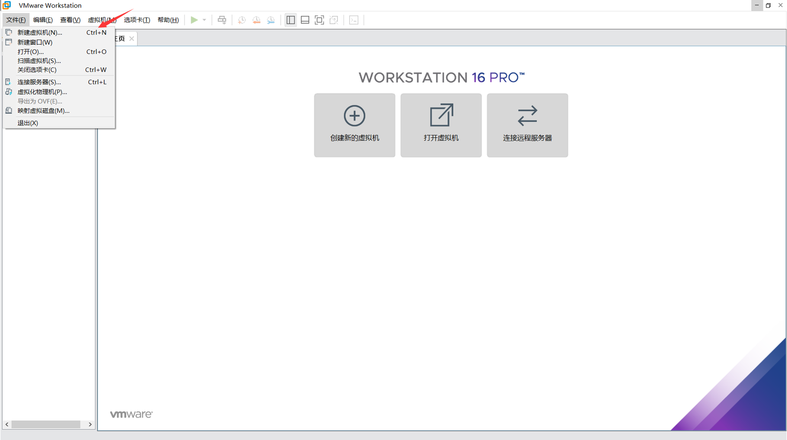
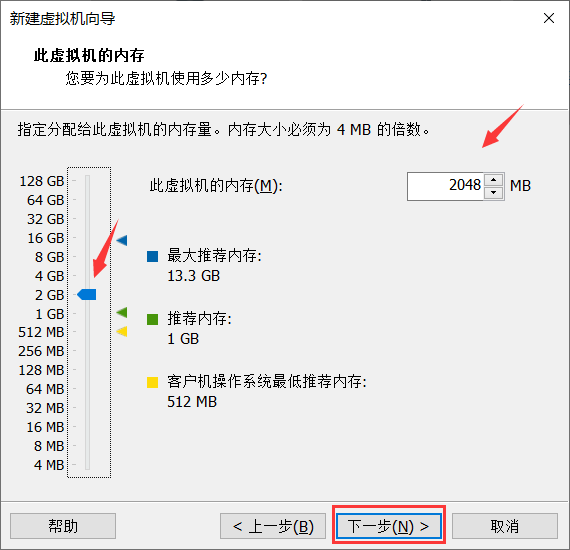

# Linux系统安装过程

**此次安装的Linux系统所用的镜像为CentOS 7**

**下载地址：http://mirrors.aliyun.com/centos/7/isos/x86_64/CentOS-7-x86_64-DVD-2009.iso**

**主流： 目前的Linux操作系统主要应用于生产环境，主流企业级Linux系统仍旧是RedHat或者CentOS**

**本文件主要演示安装步骤，因为有VM16版本的校验码，而且安装步骤是一样的，所以安装VM16版本的软件**

## 一：安装VMware

**VMware基础介绍**

　　**VMWare虚拟机软件是一个“虚拟PC”软件，它使你可以在一台机器上同时运行二个或更多Windows、DOS、LINUX系统。与“多启动”系统相比，VMWare采用了完全不同的概念。多启动系统在一个时刻只能运行一个系统，在系统切换时需要重新启动机器。**

　　**此次下载的VMWare版本：VMware-workstation-full-16.1.0-17198959**

### 第一步：打开VMware安装包

**打开安装包点击下一步**

### 第二步：点击我接受的对勾

**点击我接受的对勾，然后点击下一步**

### 第三步：选择自己安装vm的磁盘位置

**选择自己安装vm的磁盘位置，下载位置可以自行设置，然后点击下一步**

###  第四步：把对勾去掉

**把对勾去掉，点击下一步**

### 第五步：进行安装

**点击下一步后，会弹出安装，我们点击进行安装**

### 第六步：安装完成后，点击许可证

### 第七步：输入许可证

**ZF3R0-FHED2-M80TY-8QYGC-NPKYF(这个是16版本的许可证码)**

### 第八步：安装成功

**到此咱们已经安装成功，咱们可自己在桌面上找到图标打开即可使用**

 

## 二：创建Linux虚拟机

### 第1步：安装VMware Workstation

**上面安装已完毕**

### 第2步：点击新建虚拟机

**文件 → 新建虚拟机 或 直接点击 创建新的虚拟机 图标**

### 第3步：选自定义→ 下一步

### 第4步：点击稍后安装操作系统

### 第5步：选择操作系统和版本

### 第6步：输入虚拟机名称和安装路径

**注意：这个位置是之后的Linux系统存放的位置，内存要充足，切勿c盘！！！**

### 第7步：设置处理器和内核，并设置磁盘大小

**此处的内存推荐调的大些，2G足够，考虑后面在Linux里运行项目和数据库**

**后面的这几项设置默认的就可以**

**选择创建新的虚拟机磁盘**

**下图这里磁盘空间可以设置的大些，虽然选择了128，也可以选择64，根据自己配置设定，其实是用多少占多少，如果设置过小，可能装一些东西就没空间了，如果设置的过小也可以在虚拟机设置里面调整**

**注意：推荐这里选择将虚拟磁盘储存为多文件，多文件可以减轻压力，单文件容易造成系统负载大。单文件占用的是磁盘上的某一连续区域，读取速度快占用内存大。多文件分散在各个扇区读取速度一般但是占用内存小。**

### 第8步：自定义硬件

**选择编辑虚拟机设置，给虚拟机选择要安装的Linux磁盘系统文件**

### 第9步：选择CentOS安装镜像文件、

**在这里选择下载的系统镜像，之后进行安装**

**在这里也可以对之前设置的内存进行修改**

### 第10步：启动虚拟机

**点击开启虚拟机进行接下来的系统安装设置**

**进入这里，鼠标点一下消失进入Linux选项，选择安装CentOS回车**

**注意：这里启动虚拟机后鼠标点击了页面会出现鼠标消失不能操作的现象，这种情况可以    Ctrl+Alt    组合键让鼠标出现**

### 第11步：接下来就可以进入图形化安装界面了..

**选择中文和英文皆可**

**点击日期和时间设置时区**

**下图这里的时区选择地区亚洲，城市上海，然后点击完成**

**点击这里设置软件选择设置**

**下图这里可以设置个类似windows的可视化界面，操作稍简单，也可以鼠标右键打开终端输入Linux命令，推荐推荐！！**

### 第12步：接下来就是挂载文件目录到磁盘上啦

**下图这里点击磁盘样式图像，然后点击配置分区选项，之后点击完成**

**关于分区的几个目录的说明：
 /：根分区；
 swap：交换分区，可以当虚拟内存使用；
 /boot：存储系统的引导信息和内核信息；
 /usr：存储系统应用软件安装信息；
 /var：存储系统日志信息;**

**/home目录：存放家目录(相当于windows的用户目录)的目录，但是home本身不是家目录.**

**设置分区内存(因为之前的是128G内存安装的，第一次是尝试，此次为20G的安装示范)**

**这里选择接受更改，之后完成退出磁盘设置页面**

### 第13步：开启网络

**下图这里把右上角的网络开关打开，左下角设置主机名**

### 第14步：开始安装

**在安装的过程中，我们可以设置一下root密码，第二个是创建一个常用账号(*￣▽￣)y，常用账户这里不设置进去之后也要设置的**

**在这里我们可以设置我们的root密码，设置完成之后点击完成退出**

### 第15步：重启机器，完成剩余的配置

**系统第一次启动要接受许可证，同意协议后完成配置**

**之后点击完成配置，开始接下来设置语言，输入，位置服务和时区**

**下图这里时区还是选择上海就行**

**这个是设置常用账号，密码要求复杂些，之后就登陆完成了**

**进入页面，点击右上角的叉号就行**

### 第16步：打开虚拟机的终端，查看IP

**查看虚拟机的ip地址，命令：ifconfig  或者  ip addr**

**本机验证，连接无误**

**虚拟机可以正常上网**

